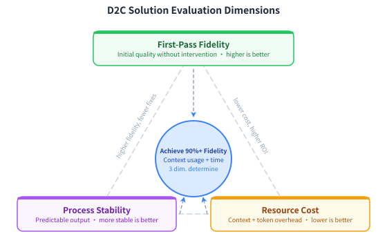
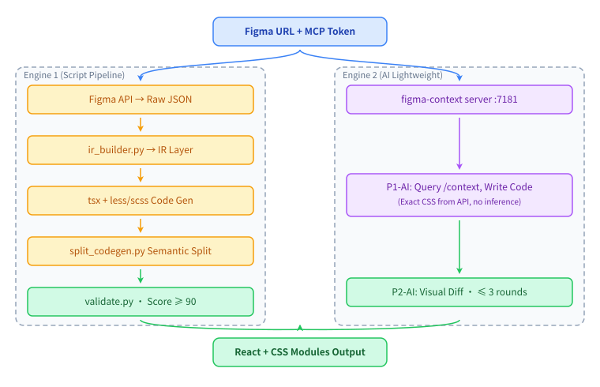
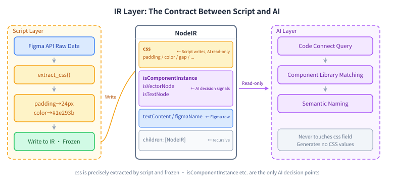
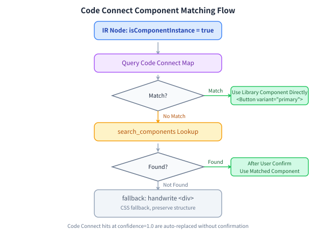
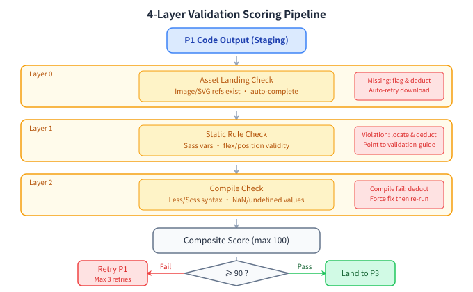
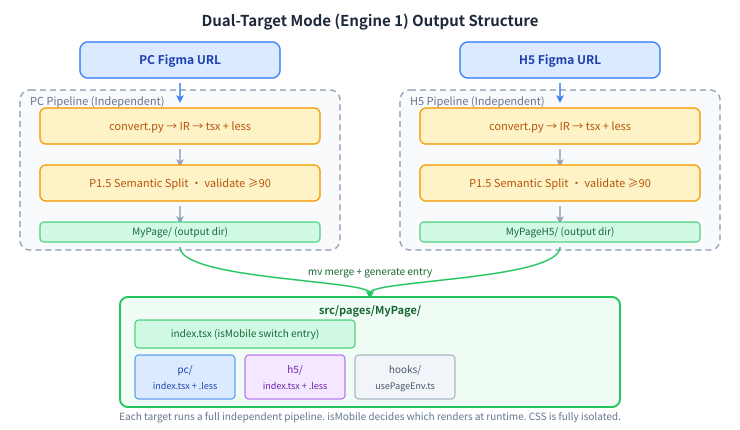

**[中文](README.zh-CN.md) | English**

# figma-to-code

**Figma Design → Pixel-Perfect React + CSS Modules**

Convert Figma designs into production-ready code with correct structure, matching styles, and zero guesswork. Built on deterministic Python scripts (no AI randomness), with support for design tokens, component library mapping, and PC/H5 dual-target output.

[](https://github.com/bybit-exchange/figma-to-code/blob/main/LICENSE)
[](https://github.com/bybit-exchange/figma-to-code)

---

## Install

Paste this to your coding agent:

```
Install the figma-to-code skill from https://github.com/bybit-exchange/figma-to-code
for me by running: npx skills add bybit-exchange/figma-to-code -g
```

Or run it yourself:

```bash
npx skills add bybit-exchange/figma-to-code -g
```

The CLI detects which agents you have installed and writes each one's path. Drop `-g` to install into the current project instead.

| Surface | Path |
|---|---|
| Claude Code | `~/.claude/skills/figma-to-code/` |
| Codex, Cursor, Gemini CLI, Copilot, opencode, Antigravity | `~/.agents/skills/figma-to-code/` |
| Pi | `~/.pi/skills/figma-to-code/` |
| Windsurf, Continue, Roo, Goose, Kiro, Trae and 40+ more | `~/.<agent>/skills/figma-to-code/` |

If you only want the skill text:

```bash
mkdir -p ~/.claude/skills/figma-to-code
curl -fsSL https://raw.githubusercontent.com/bybit-exchange/figma-to-code/main/skills/figma-to-code/SKILL.md \
  -o ~/.claude/skills/figma-to-code/SKILL.md
```

Then start a new session and trigger it with a Figma URL — the agent should announce that it's using `figma-to-code`.

---

## Figma Token Setup

The skill looks for a token in the following order:

```bash
# Option 1 (recommended): write to file
echo "your_figma_token" > ~/.claude/figma-token

# Option 2: environment variable
export FIGMA_ACCESS_TOKEN=your_figma_token
```

Generate a Personal access token from your [Figma account settings](https://www.figma.com/settings).

---

## Prerequisites

| Dependency | Notes |
|---|---|
| [Claude Code](https://claude.ai/code) | CLI version ≥ 1.0 |
| Figma MCP | `figma-developer-mcp` or the official [Figma MCP](https://github.com/figma/figma-developer-mcp) |
| Figma API Token | Generate from Figma personal settings (Personal access token) |
| Python 3 | stdlib only — no extra dependencies |
| Node.js + pnpm | Target project build environment (for TypeScript compilation checks) |

---

## Why

AI coding tools handle logic, API integration, and tests reliably. Visual restoration is where they consistently fall short: first-pass fidelity is unpredictable, correction loops are expensive, and human review of pixel errors is almost unavoidable.

The root cause isn't model capability — it's **information format**. The raw Figma node tree is built for designers, not for code execution. Feeding it directly to an AI produces either context overflow or a model that ignores most of it and guesses from screenshots.

figma-to-code flips the model: instead of handing the AI a blob of Figma data to interpret, it converts Figma's structured data into a **queryable reference** that the Coding Agent reads on demand — like a developer who keeps switching back to the design file to verify exact values rather than guessing from memory.

**Three numbers that matter:**

| Metric | Value |
|---|---|
| First-pass pixel fidelity | ≥ 90% |
| End-to-end time | ≤ 15 min |
| Context consumption | ~100K tokens |



---

## How It Works

### Architecture

The system has three layers: an orchestration layer (the Skill), a dual-engine conversion layer, and a shared data + validation layer.



Both engines share the same Figma data source and 4-layer validation gate. They differ only in how the conversion is done.

| | Engine 1 (default) | Engine 2 (`--light`) |
|---|---|---|
| Best for | Pixel-perfect, complex pages | Rapid prototyping, new stacks |
| Approach | Deterministic Python pipeline | AI queries Figma context on demand |
| Consistency | High — same input → same output | Varies by run |

### Engine 1: The IR Contract

Engine 1's design principle: **anything deterministic stays in code; AI only handles what requires understanding.**

The Intermediate Representation (IR) is the boundary between the script layer and the AI layer. CSS values are extracted by script from Figma's API and frozen in the IR — the AI reads them, never infers them. The only AI judgment point is semantic component naming (`Frame123` → `ProductCard`).



### Code Connect: Automatic Component Mapping

When a node is identified as a component instance, the Code Connect decision flow runs: exact mapping table first (confidence 1.0, direct replacement), fuzzy search fallback, then `<div>` as last resort.



### Quality Gate: 4-Layer Validation

Three rule-check layers (Layer 0/1/2) plus a composite score. A score ≥ 90 is required before code lands; otherwise the pipeline retries up to 3 times. "Pass or fail" becomes a measurable number.



---

## Features

- **Pixel-perfect output**: Figma properties map deterministically to CSS (flexbox, gradients, shadows, blend modes, border-radius, etc.) — no AI hallucination
- **Design Tokens**: Set `DESIGN_TOKEN_CSS_URL` to automatically replace raw hex/rgba values with `var(--your-token)` references
- **Code Connect component mapping**: Fetches component mappings via Figma MCP and replaces design instances with real library components (e.g. `<Button>`, `<Tag>`)
- **Icon integration**: Set `ICON_PACKAGE` to auto-generate correct import statements for icon nodes
- **Dual-target (PC + H5)**: Provide two Figma URLs to generate both versions; runtime switching via `isMobile`
- **Automated validation**: Multi-layer checks (asset integrity, CSS correctness, TypeScript compilation, text content)

---

## Usage

### Basic (single page)

```
/figma-to-code https://www.figma.com/design/<fileKey>/<Name>?node-id=<nodeId>&m=dev
```

### Dual-target (PC + H5)

```
/figma-to-code <PC Figma URL> <H5 Figma URL>
```

Generates two independent code sets, toggled at runtime via the `isMobile` value from the `usePageEnv` hook. Both targets run the full Engine 1 pipeline independently — a change to one side never affects the other.



### Lightweight AI mode (Engine 2)

For rapid prototyping — skips the script pipeline and uses AI to read Figma's Context API directly:

```
/figma-to-code <URL> --light
```

### Other options

| Flag | Description |
|---|---|
| `--no-split` | Skip sub-component extraction; output a single file |
| `--css-ext=scss` | Force SCSS output (default: auto-detect) |
| `--engine=script` | Force script engine (Engine 1) |
| `--engine=ai` | Force lightweight AI engine (Engine 2) |
| `focus-id=<nodeId>` | Convert only the specified sub-node |

---

## Optional: Design Token Integration

If your project uses a CSS custom property design system, set this environment variable to have all bare hex/rgba values replaced with `var(--your-token, fallback)` format:

```bash
export DESIGN_TOKEN_CSS_URL=https://your-cdn.com/tokens.css
```

Example token CSS file (any `--`-prefixed CSS variable is recognized):

```css
:root {
  --color-primary: #1677ff;
  --color-text-primary: #141414;
  --font-size-md: 14px;
  --border-radius-sm: 4px;
}
```

Cache path: `.figma-to-code/1-design-token/design-tokens.json` (TTL: 24h).

---

## Optional: Icon Package Integration

If your project has an icon component library (e.g. `@your-org/icons`), set this variable to auto-generate import statements for icon nodes:

```bash
export ICON_PACKAGE=@your-org/icons
```

Without this, icon nodes fall back to `` rendering with no imports.

---

## Optional: Code Connect Component Mapping

If your Figma file is configured with [Code Connect](https://www.figma.com/code-connect/), the skill will automatically query the mapping at conversion time and replace Figma instances with the corresponding project library components.

No extra configuration needed — the skill calls `get_code_connect_map` via Figma MCP during the P1 phase.

If Code Connect is not configured, component instances fall back to `<div>` rendering.

---

## Workflow (Engine 1)

```
P0  Init         Detect Figma token, project environment, CSS extension
P1  Convert      python3 convert.py → IR → TSX + CSS Modules
    P1.5 Split   python3 split_components.py → sub-component directories
P2  Validate     python3 validate.py → multi-layer quality checks
P3  Land         Write code and assets to the target project
```

All intermediate artifacts are saved under `.figma-to-code/`:

```
.figma-to-code/
├── 1-raw-data/          Raw Figma API data (IR source)
├── 1-assets/            Exported SVG/PNG assets
├── 1-design-token/      Design token cache (from DESIGN_TOKEN_CSS_URL)
├── 2-figma-extract/     IR JSON + Code Connect JSON
├── 3-page-code/         Conversion staging area (stage/)
└── 4-test-output/       Test reports
```

---

## Directory Structure

```
skills/figma-to-code/
├── SKILL.md                     Main skill instruction file
├── references/                  Reference docs (loaded on demand)
│   ├── css-mapping.md           Figma → CSS full mapping rules
│   ├── ir-schema.md             IR data structure reference
│   ├── validation-guide.md      Validation layers and fix guidance
│   ├── semantic-split.md        Component split rules
│   ├── parallel-guide.md        Multi-URL parallel conversion guide
│   └── dev-change-guide.md      Script dev conventions (required reading before editing)
└── scripts/
    ├── convert.py               Figma → IR → TSX + CSS (main conversion script)
    ├── split_components.py      IR → split sub-components
    ├── validate.py              Multi-layer validation (assets / CSS / compilation / text)
    ├── validate_split.py        Split artifact validation
    ├── lib/                     Core modules
    │   ├── ir_builder.py        IR builder (Figma nodes → IR tree)
    │   ├── css_extractor.py     CSS property extraction
    │   ├── tsx_generator.py     TSX code generation
    │   ├── split_codegen.py     Component split code generation
    │   ├── token_resolver.py    Design token replacement
    │   ├── boundary_detector.py Component boundary detection
    │   └── code_connect.py      Code Connect parsing
    └── tests/                   Unit tests + integration tests
        ├── test_all.py          Run all unit tests
        └── ...
```

---

## Development & Testing

### Run unit tests

```bash
cd skills/figma-to-code/scripts
python3 tests/test_all.py
# Expected: 36/36 suites pass, ~1200+ cases
```

### Run visual regression tests

Requires a valid Figma URL and token:

```bash
# Quick mode (skip Code Connect)
python3 scripts/tests/test_visual.py \
  --from-ir \
  --url='https://www.figma.com/design/<fileKey>/PageName?node-id=<nodeId>&m=dev'

# Fixed working directory (keep sandbox for debugging)
python3 scripts/tests/test_visual.py \
  --from-ir \
  --url='...' \
  --work-dir=/tmp/figma-visual-debug
```

Reports are written to `.figma-to-code/4-test-output/`.

### Script modification guidelines

See `references/dev-change-guide.md`: **write tests → change code → run tests → pass**. Skipping tests and editing logic directly is not allowed.

---

## FAQ

**Q: The generated CSS class names contain brand words from the design file — is that expected?**  
A: Yes. Class names are derived from Figma layer names and text content (e.g. `get-your-card`). This is intentional deterministic behavior.

**Q: `validate_split` Layer 1 reports a "CSS drift" error?**  
A: This happens when using a cached IR (`--from-ir`) with an updated split algorithm where class name generation has slightly changed. Re-run a full conversion without `--from-ir` to resolve.

**Q: Design tokens are not being applied?**  
A: Verify that the CSS file at `DESIGN_TOKEN_CSS_URL` contains `--`-prefixed custom properties and the URL is accessible. The cache TTL is 24h; delete `.figma-to-code/1-design-token/` to force a refresh.

**Q: Icon nodes render as `` instead of components?**  
A: Set the `ICON_PACKAGE` environment variable to your icon package name (e.g. `@your-org/icons`). The exported names in the package must match the Figma layer names.

---

## Contributing

Before opening a PR, use the skill for a real task in a fresh session. If the agent didn't load it on its own, the `description` field in SKILL.md needs work. If the output still needed manual correction, the body is missing a rule.

Bug reports, feature requests, and improvements are welcome — open an issue or PR at [github.com/bybit-exchange/figma-to-code](https://github.com/bybit-exchange/figma-to-code).

---

## License

[MIT](https://github.com/bybit-exchange/figma-to-code/blob/main/LICENSE)
