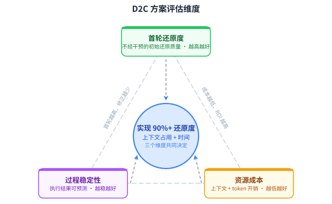
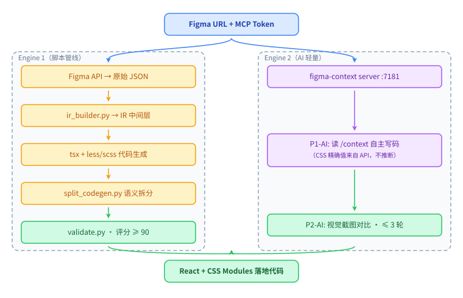
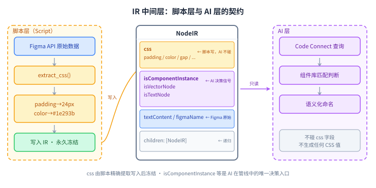
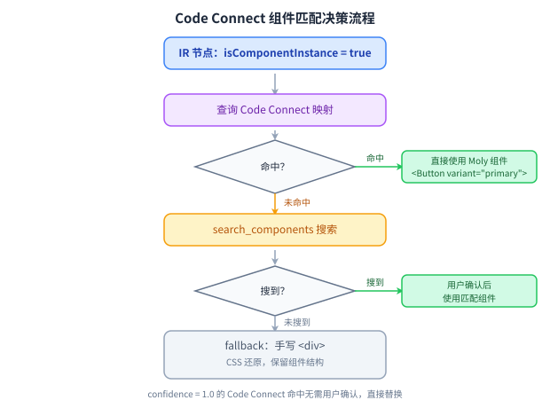
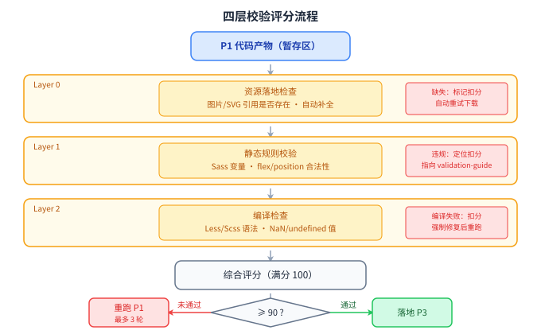
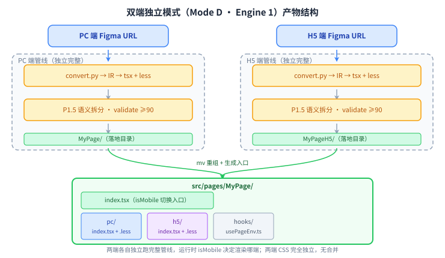

**中文 | [English](README.md)**

# figma-to-code

**Figma 设计稿 → 像素级 React + CSS Modules 代码**

将 Figma 设计稿转换为结构正确、风格匹配、可直接落地的生产级代码。基于 Python 确定性脚本（零 AI 随机性），支持 design token 替换、组件库映射和 PC/H5 双端转换。

[](https://github.com/bybit-exchange/figma-to-code/blob/main/LICENSE)
[](https://github.com/bybit-exchange/figma-to-code)

---

## 安装

将以下内容粘贴给你的 AI 编程助手：

```
从 https://github.com/bybit-exchange/figma-to-code 安装 figma-to-code skill，
运行命令：npx skills add bybit-exchange/figma-to-code -g
```

或者自行运行：

```bash
npx skills add bybit-exchange/figma-to-code -g
```

CLI 会自动检测已安装的 Agent 并写入对应路径。去掉 `-g` 可安装到当前项目。

| 平台 | 安装路径 |
|---|---|
| Claude Code | `~/.claude/skills/figma-to-code/` |
| Codex, Cursor, Gemini CLI, Copilot, opencode, Antigravity | `~/.agents/skills/figma-to-code/` |
| Pi | `~/.pi/skills/figma-to-code/` |
| Windsurf, Continue, Roo, Goose, Kiro, Trae 等 40+ | `~/.<agent>/skills/figma-to-code/` |

如果只需要 skill 文本文件：

```bash
mkdir -p ~/.claude/skills/figma-to-code
curl -fsSL https://raw.githubusercontent.com/bybit-exchange/figma-to-code/main/skills/figma-to-code/SKILL.md \
  -o ~/.claude/skills/figma-to-code/SKILL.md
```

安装后开启新会话，发送一个 Figma URL 即可触发——Agent 应主动宣告正在使用 `figma-to-code`。

---

## 配置 Figma Token

skill 按以下优先级查找 token：

```bash
# 方式一（推荐）：写入文件
echo "your_figma_token" > ~/.claude/figma-token

# 方式二：环境变量
export FIGMA_ACCESS_TOKEN=your_figma_token
```

在 [Figma 个人设置](https://www.figma.com/settings) 中生成 Personal access token。

---

## 前提依赖

| 依赖 | 说明 |
|------|------|
| [Claude Code](https://claude.ai/code) | CLI 版本 ≥ 1.0 |
| Figma MCP | `figma-developer-mcp` 或官方 [Figma MCP](https://github.com/figma/figma-developer-mcp) |
| Figma API Token | 从 Figma 个人设置生成（Personal access token） |
| Python 3 | stdlib 即可，零额外依赖 |
| Node.js + pnpm | 目标项目构建环境（用于 TypeScript 编译验证） |

---

## 为什么需要这个工具

AI 编程工具在逻辑实现、接口对接、单元测试上越来越可靠，但视觉还原一直是短板：首轮还原度不可预测、修正循环消耗大、像素走查几乎必须人工介入。

根本原因不是模型能力不够，而是**信息格式不对**。Figma 原始节点树是为设计师构建的，不是为代码执行准备的。把它直接给 AI，要么上下文爆炸，要么 AI 忽略大部分信息、靠截图猜数字。

figma-to-code 的核心翻转：把设计稿从「一次性输入」变成「随时可查询的参考资料」，让 Coding Agent 在有完整项目上下文的情况下按需获取精确的视觉数值——就像有经验的前端开发者反复切回设计稿确认细节，而不是全靠记忆推断。

**三个关键数字：**

| 指标 | 数值 |
|---|---|
| 首轮像素还原度 | ≥ 90% |
| 端到端完成时间 | ≤ 15 分钟 |
| 上下文消耗 | ~100K tokens |



---

## 工作原理

### 整体架构

系统由三层构成：编排层（Skill）、双引擎转换层、数据与校验层。



两个引擎共用同一份 Figma 数据源和 4 层校验门禁，区别只在于中间的转换策略：

| | Engine 1（默认） | Engine 2（`--light`） |
|---|---|---|
| 适合场景 | 像素级还原、复杂页面 | 快速原型、新技术栈 |
| 核心方式 | 确定性 Python 管线 | AI 按需查询 Figma Context |
| 产出一致性 | 高，相同输入产出相同结果 | 一般，依赖 AI 当次判断 |

### Engine 1：IR 契约

Engine 1 的设计原则：**能用确定性解决的，绝不交给 AI。**

IR（中间表示）是脚本层与 AI 层之间的边界。CSS 数值由脚本从 Figma API 精确提取后写入 IR 并冻结——AI 只读，不推断。AI 唯一的判断点是语义化组件命名（`Frame123` → `ProductCard`）。



### Code Connect：组件库自动对接

当节点被识别为组件实例时，Code Connect 决策流程启动：先查精确映射表（confidence 1.0 直接替换），再模糊搜索，最终兜底为 `<div>`。



### 质量门禁：4 层校验

三层规则检查（Layer 0/1/2）加综合评分，评分 ≥ 90 才允许落地，否则最多重跑 3 次。「行不行」从主观判断变成可量化的数字。



---

## 功能

- **像素级还原**：Figma 属性 → CSS 确定性映射（flexbox、渐变、阴影、混合模式、圆角等），无需 AI 猜测
- **Design Token**：配置 `DESIGN_TOKEN_CSS_URL` 后，自动将 hex/rgba 替换为 `var(--your-token)` 引用
- **Code Connect 组件映射**：通过 Figma MCP 获取组件库映射，自动将设计稿中的实例替换为项目组件库组件（如 `<Button>`、`<Tag>`）
- **图标集成**：配置 `ICON_PACKAGE` 后，图标节点自动生成正确的 import 语句
- **双端支持**：两个 Figma URL 即可生成 PC + H5 双端代码，通过运行时 `isMobile` 切换显示
- **自动化验证**：内置多层验证（资源完整性、CSS 正确性、TypeScript 编译、文字内容等）

---

## 使用方式

### 基本用法（单页）

```
/figma-to-code https://www.figma.com/design/<fileKey>/<Name>?node-id=<nodeId>&m=dev
```

### 双端（PC + H5）

```
/figma-to-code <PC Figma URL> <H5 Figma URL>
```

生成两套独立代码，通过 `usePageEnv` hook 的 `isMobile` 在运行时切换。两端各自独立跑完整的 Engine 1 管线，互不影响。



### 轻量 AI 模式（Engine 2）

适合快速原型，跳过脚本转换，改用 AI 直接读取 Figma Context API 写代码：

```
/figma-to-code <URL> --light
```

### 其他参数

| 参数 | 说明 |
|------|------|
| `--no-split` | 不拆分子组件，输出单文件 |
| `--css-ext=scss` | 强制使用 SCSS（默认自动检测） |
| `--engine=script` | 强制使用脚本引擎（Engine 1） |
| `--engine=ai` | 强制使用 AI 轻量引擎（Engine 2） |
| `focus-id=<nodeId>` | 只转换指定子节点 |

---

## 可选：Design Token 集成

如果项目有 CSS 自定义属性设计系统，配置此环境变量后，生成代码中的裸 hex/rgba 值会自动替换为 `var(--your-token, fallback)` 格式：

```bash
export DESIGN_TOKEN_CSS_URL=https://your-cdn.com/tokens.css
```

token CSS 文件示例（任意 `--` 开头的 CSS 变量均可识别）：

```css
:root {
  --color-primary: #1677ff;
  --color-text-primary: #141414;
  --font-size-md: 14px;
  --border-radius-sm: 4px;
}
```

缓存路径：`.figma-to-code/1-design-token/design-tokens.json`（TTL 24h）。

---

## 可选：图标包集成

如果项目有图标组件库（如 `@your-org/icons`），配置此变量后，图标节点会自动生成正确的 import 语句：

```bash
export ICON_PACKAGE=@your-org/icons
```

未配置时，图标节点回退为 `` 渲染，不生成任何 import。

---

## 可选：Code Connect 组件映射

如果 Figma 文件已配置 [Code Connect](https://www.figma.com/code-connect/)，skill 会在转换时自动查询映射，将 Figma 实例替换为对应的项目组件库组件。

无需额外配置——skill 在 P1 阶段自动调用 Figma MCP 的 `get_code_connect_map` 获取映射。

若未配置 Code Connect，组件实例会降级为 `<div>` 还原。

---

## 工作流（Engine 1）

```
P0  初始化          检测 Figma token、项目环境、CSS 扩展名
P1  转换            python3 convert.py → IR → TSX + CSS Modules
    P1.5 组件拆分   python3 split_components.py → 子组件目录
P2  验证            python3 validate.py → 多层质量检查
P3  落地            代码和资源写入目标项目
```

所有中间产物保存在 `.figma-to-code/`：

```
.figma-to-code/
├── 1-raw-data/          Figma API 原始数据（IR 构建源）
├── 1-assets/            导出的 SVG/PNG 资源
├── 1-design-token/      Design token 缓存（来自 DESIGN_TOKEN_CSS_URL）
├── 2-figma-extract/     IR JSON + Code Connect JSON
├── 3-page-code/         转换产物暂存区（stage/）
└── 4-test-output/       测试报告
```

---

## 目录结构

```
skills/figma-to-code/
├── SKILL.md                     skill 主指令文件
├── references/                  参考文档（按需读取）
│   ├── css-mapping.md           Figma → CSS 完整映射规则
│   ├── ir-schema.md             IR 数据结构说明
│   ├── validation-guide.md      验证层说明与修复指引
│   ├── semantic-split.md        组件拆分规则
│   ├── parallel-guide.md        多 URL 并行转换指引
│   └── dev-change-guide.md      脚本开发规范（改代码必读）
└── scripts/
    ├── convert.py               Figma → IR → TSX + CSS（主转换脚本）
    ├── split_components.py      IR → 拆分子组件
    ├── validate.py              多层验证（资源/CSS/编译/文字）
    ├── validate_split.py        拆分产物校验
    ├── lib/                     核心模块
    │   ├── ir_builder.py        IR 构建（Figma 节点 → IR 树）
    │   ├── css_extractor.py     CSS 属性提取
    │   ├── tsx_generator.py     TSX 代码生成
    │   ├── split_codegen.py     组件拆分代码生成
    │   ├── token_resolver.py    Design token 替换
    │   ├── boundary_detector.py 组件边界检测
    │   └── code_connect.py      Code Connect 解析
    └── tests/                   单元测试 + 集成测试
        ├── test_all.py          运行全部单测
        └── ...
```

---

## 开发与测试

### 运行单元测试

```bash
cd skills/figma-to-code/scripts
python3 tests/test_all.py
# 预期：36/36 suites 通过，约 1200+ cases
```

### 运行 Visual 回归测试

需要有效的 Figma URL 和 Figma token：

```bash
# 快速模式（跳过 Code Connect）
python3 scripts/tests/test_visual.py \
  --from-ir \
  --url='https://www.figma.com/design/<fileKey>/PageName?node-id=<nodeId>&m=dev'

# 固定工作目录（保留 sandbox 供调试）
python3 scripts/tests/test_visual.py \
  --from-ir \
  --url='...' \
  --work-dir=/tmp/figma-visual-debug
```

报告输出到 `.figma-to-code/4-test-output/`。

### 修改脚本的规范

见 `references/dev-change-guide.md`：**写单测 → 改代码 → 跑单测 → 通过**。不允许跳过单测直接改逻辑。

---

## 常见问题

**Q: 生成的 CSS 类名包含设计稿中的品牌词，正常吗？**  
A: 正常。类名从 Figma 图层名和文字内容派生（如 `get-your-card`），这是确定性生成的预期行为。

**Q: validate_split Layer 1 报"CSS 漂移"错误？**  
A: 当使用旧 IR 缓存（`--from-ir`）+ 更新后的 split 算法时，类名生成规则可能有微小变化，导致 Layer 1 漂移。重新全量转换（不加 `--from-ir`）即可解决。

**Q: Design token 没有生效？**  
A: 确认 `DESIGN_TOKEN_CSS_URL` 指向的 CSS 文件包含 `--` 开头的自定义属性，且 URL 可访问。缓存 TTL 24h，删除 `.figma-to-code/1-design-token/` 可强制刷新。

**Q: 图标节点渲染为 `` 而非组件？**  
A: 需要设置 `ICON_PACKAGE` 环境变量为图标包名（如 `@your-org/icons`）。包内的导出名称需与 Figma 图层名匹配。

---

## 贡献

提交 PR 前，请在全新会话中用 skill 完成一次真实任务。如果 Agent 没有自动加载它，说明 SKILL.md 中的 `description` 字段需要改进；如果输出仍需手动修正，说明正文缺少规则。

欢迎提交 Bug 报告、功能请求或改进——在 [github.com/bybit-exchange/figma-to-code](https://github.com/bybit-exchange/figma-to-code) 提 issue 或 PR。

---

## 许可证

[MIT](https://github.com/bybit-exchange/figma-to-code/blob/main/LICENSE)
